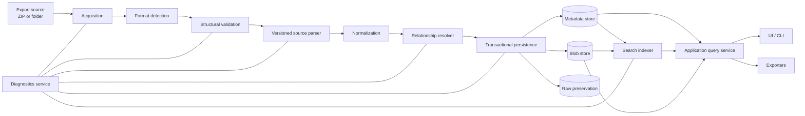
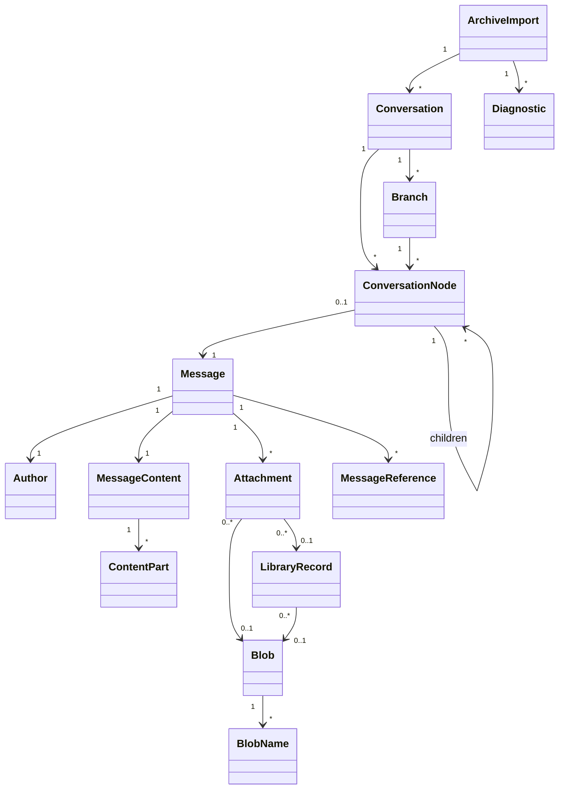
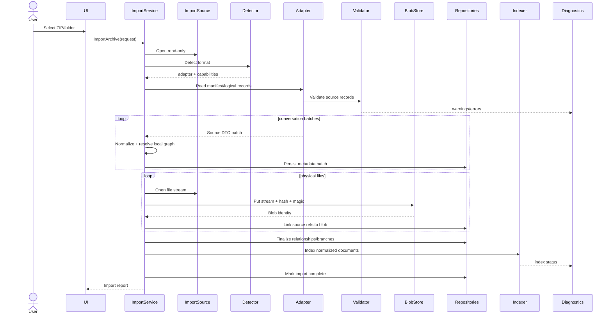
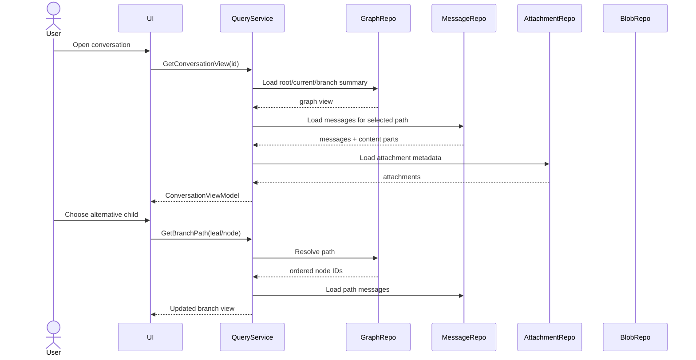
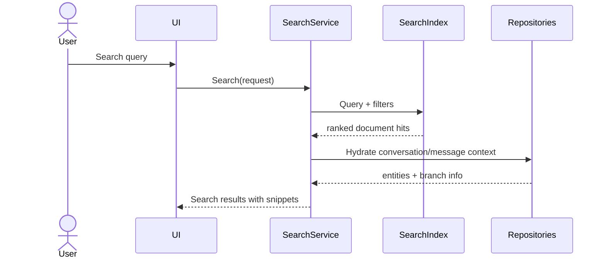
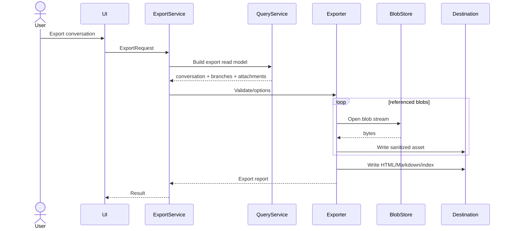

# Chat Archive Explorer — Architecture Specification v1.0

## Нормативная архитектурная спецификация

**Статус:** проект архитектуры для утверждения  
**Версия:** 1.0  
**Дата:** 1 августа 2026 г.  
**Нормативная основа:** `Export Format Specification v1.0`  
**Назначение:** единый архитектурный источник истины для Roadmap и последующей реализации Chat Archive Explorer

---

## 0. Нормативный статус

Этот документ определяет целевую архитектуру Chat Archive Explorer. Он не является реализацией, программным кодом или планом версий.

Архитектурные решения основаны только на `Export Format Specification v1.0`. Промежуточные исследовательские отчёты не являются нормативными источниками и не должны использоваться для принятия проектных решений.

При расхождении между будущей реализацией и настоящей спецификацией приоритет имеет эта спецификация до её явного пересмотра.

Термины **MUST**, **MUST NOT**, **SHOULD**, **SHOULD NOT** и **MAY** используются в инженерном смысле:

- **MUST** — обязательное требование;
- **MUST NOT** — запрещённое решение или допущение;
- **SHOULD** — рекомендуемое решение;
- **SHOULD NOT** — решение, допустимое только по документированной причине;
- **MAY** — необязательная возможность.

---

# 1. Цели архитектуры

Chat Archive Explorer должен быть локальным, расширяемым и отказоустойчивым приложением для импорта, нормализации, хранения, поиска, просмотра и экспорта архивов ChatGPT.

Архитектура должна обеспечивать:

1. независимость внутренней модели от структуры экспорта OpenAI;
2. полное сохранение графа разговоров, включая альтернативные ветви;
3. сохранение исходных данных без потерь;
4. отделение логических вложений от физических файлов;
5. воспроизводимый и диагностируемый импорт;
6. поддержку больших архивов без загрузки всего набора в память;
7. локальную работу без подключения к интернету;
8. возможность добавлять новые версии внешнего формата через адаптеры;
9. несколько представлений одного архива: поиск, GUI, HTML, Markdown, JSON;
10. возможность повторного импорта и последующего инкрементального обновления.

## 1.1. Не-цели текущего архитектурного этапа

В документе не определяются:

- конкретный GUI-фреймворк;
- окончательный внешний дизайн интерфейса;
- roadmap и номера релизов;
- публичный API плагинов;
- облачная синхронизация;
- интеллектуальный или векторный поиск;
- сетевые сервисы;
- конкретные классы и сигнатуры методов.

Архитектура должна оставлять эти возможности открытыми, но не зависеть от них.

---

# 2. Основные архитектурные принципы

## 2.1. Hexagonal / Ports and Adapters

Ядро приложения не должно знать, что исходные данные пришли из `conversations.json`, `chat.html`, ZIP или будущего API.

Внешние форматы подключаются через адаптеры импорта. Хранилище, поисковый движок, GUI и экспортёры подключаются через порты.

```text
External ChatGPT Export
          │
          ▼
   Import Adapter
          │ normalized commands/events
          ▼
      Domain Core
       /   |    \
      /    |     \
Storage  Search  Export/View
Adapters Adapters Adapters
```

## 2.2. Raw preservation + normalization

Каждый импорт должен создавать два логических слоя:

1. **Raw layer** — исходные значения и неизвестные поля;
2. **Normalized layer** — стабильная внутренняя модель приложения.

Нормализация не должна уничтожать исходные данные.

## 2.3. Graph first

Разговор является графом-деревом сообщений, а не линейным списком. Линейная активная цепочка — производное представление.

## 2.4. Content as ordered heterogeneous parts

Контент сообщения должен храниться как упорядоченная последовательность типизированных частей. Текст является одним из вариантов, а не универсальной формой сообщения.

## 2.5. Logical references are not physical ownership

`Attachment`, `LibraryRecord` и `Blob` — разные сущности:

- attachment описывает логическую связь с сообщением;
- library record описывает запись библиотеки OpenAI;
- blob описывает физические байты.

Один blob может иметь несколько логических ссылок и исходных имён.

## 2.6. Provenance everywhere

Каждое нормализованное значение, которое могло быть получено из нескольких источников, должно иметь происхождение и уровень доверия.

## 2.7. Fail soft, report hard

Повреждение отдельного разговора или файла не должно останавливать весь импорт. Ошибка должна быть зарегистрирована, локализована и представлена пользователю.

## 2.8. Derived data is rebuildable

Поисковый индекс, HTML, Markdown, thumbnails и кэш представления должны быть производными и пересоздаваемыми. Источником истины являются нормализованные данные, raw payload и blob storage.

---

# 3. Высокоуровневая архитектура



## 3.1. Основные подсистемы

| Подсистема | Ответственность |
|---|---|
| Acquisition | Чтение папки или ZIP без изменения источника |
| Format Detection | Определение версии и состава экспорта |
| Validation | Проверка манифеста, JSON, графов и файлов |
| Source Parser | Разбор внешней схемы OpenAI |
| Normalization | Преобразование во внутреннюю модель |
| Relationship Resolver | Восстановление связей conversation/message/asset/library/blob |
| Persistence | Транзакционное сохранение нормализованных данных и raw payload |
| Blob Store | Контент-адресуемое хранение физических файлов |
| Search | Индексация текста, кода, метаданных и файловых имён |
| Query/Application Services | Сценарии чтения и навигации |
| Conversation Renderer | Построение активных и альтернативных ветвей |
| Exporters | HTML, Markdown, normalized JSON и другие форматы |
| Diagnostics | Ошибки, предупреждения, статистика и отчёты импорта |
| UI/CLI | Пользовательские интерфейсы поверх application services |

---

# 4. Слои системы

## 4.1. Domain layer

Содержит стабильные сущности, value objects и доменные правила. Не зависит от JSON, SQLite, файловой системы, UI и HTML.

## 4.2. Application layer

Оркестрирует use cases:

- импорт архива;
- открытие разговора;
- получение ветвей;
- поиск;
- экспорт;
- диагностика;
- повторная индексация;
- проверка целостности.

## 4.3. Infrastructure layer

Реализует порты:

- SQLite repository;
- filesystem blob store;
- ZIP reader;
- JSON streaming reader;
- FTS index;
- HTML/Markdown writers;
- системный file picker;
- logging.

## 4.4. Presentation layer

CLI и будущий GUI. Не содержит логики разбора экспортов или прямых SQL-запросов.

---

# 5. Внутренняя доменная модель

## 5.1. Общая схема



## 5.2. ArchiveImport

Представляет один запуск импорта конкретного источника.

Основные атрибуты:

- internal import ID;
- source fingerprint;
- source path display name;
- import started/completed time;
- detected format family and version;
- application schema version;
- status;
- counts and summary;
- source manifest snapshot;
- import options;
- diagnostic summary.

`ArchiveImport` не равен пользовательскому архиву как долгоживущей библиотеке. Несколько импортов могут относиться к одной логической коллекции и использоваться для будущего сравнения или обновления.

## 5.3. Conversation

Стабильная доменная сущность разговора.

Атрибуты:

- internal conversation ID;
- source namespace;
- source conversation ID;
- alternate source identifiers;
- title;
- created/updated timestamps;
- current node internal ID;
- archive/study/memory flags;
- default model reference;
- raw properties;
- import provenance.

Правила:

- разговор владеет набором nodes;
- разговор не владеет blob напрямую;
- active path вычисляется из current node и parent links;
- unknown source fields сохраняются в raw properties.

## 5.4. ConversationNode

Отдельная позиция в графе разговора.

Атрибуты:

- internal node ID;
- conversation ID;
- source node ID;
- parent node ID, nullable;
- ordinal hints, если источник их предоставляет;
- message ID, nullable;
- raw `children` snapshot;
- structural state: valid, orphan, cyclic, inconsistent;
- import provenance.

Node и Message являются отдельными сущностями даже если source IDs совпадают.

## 5.5. Message

Атрибуты:

- internal message ID;
- source message ID;
- conversation ID;
- source node ID;
- author;
- created/updated timestamps;
- status, recipient, channel или другие известные поля;
- model slug;
- normalized content;
- raw message payload;
- raw metadata payload;
- visibility classification;
- import provenance.

`visibility classification` не удаляет сообщение. Она обозначает, например:

- active branch;
- alternative branch;
- service/root;
- unsupported render type;
- empty visible text;
- malformed.

## 5.6. Author

Value object:

- role: arbitrary string;
- name: optional string;
- raw author object.

Роль не должна быть закрытым enum. Приложение может иметь известные presentation categories, но сохраняет исходную строку.

## 5.7. MessageContent

Контейнер контента сообщения:

- source content type;
- normalized content kind;
- ordered list of `ContentPart`;
- optional normalized plain text;
- optional normalized reasoning recap;
- optional thoughts collection;
- raw content object.

`normalized plain text` — производное поле для поиска и экспорта. Оно не заменяет parts/raw.

## 5.8. ContentPart

Базовая абстракция упорядоченной части сообщения.

Известные виды:

- TextPart;
- ImagePointerPart;
- AudioTranscriptionPart;
- FileReferencePart;
- StructuredReferencePart;
- UnknownPart.

Каждая часть содержит:

- zero-based ordinal;
- source part type;
- normalized kind;
- typed fields;
- raw payload;
- optional resolved asset link;
- diagnostics.

UnknownPart обязателен для forward compatibility.

## 5.9. Attachment

Логическая ссылка от сообщения на внешний или физический объект.

Атрибуты:

- internal attachment ID;
- message ID;
- ordinal;
- source attachment ID;
- source name;
- declared MIME;
- declared size;
- library record reference;
- blob reference;
- asset pointer reference;
- relation kind;
- resolution status;
- raw attachment payload;
- provenance for each resolved field.

Attachment не хранит физические байты.

## 5.10. LibraryRecord

Нормализованное представление записи `library_files.json`.

Атрибуты:

- internal library record ID;
- source `id.id`;
- source file ID;
- name and normalized name;
- declared MIME and extension;
- declared size;
- category and artifact type;
- state;
- origination conversation/message IDs;
- image generation ID;
- app/gizmo/project references;
- timestamps;
- blob reference, nullable;
- raw record payload.

Запись может существовать без физического blob (`created`, `failed` или иной будущий state).

## 5.11. Blob

Контент-адресуемая сущность физических байтов.

Атрибуты:

- internal blob ID;
- SHA-256;
- byte size;
- detected magic signature;
- detected format family;
- detection confidence;
- storage location key;
- first 32 bytes hex;
- integrity state;
- first-seen import ID.

Blob идентифицируется содержимым, а не source filename.

## 5.12. BlobName / BlobSourceReference

Один blob может иметь несколько имён и source references.

Сохраняются:

- physical `.dat` filename;
- original filename;
- library filename;
- source extension;
- declared MIME;
- source size;
- source file ID;
- source import;
- relation provenance.

Это позволяет представить полные дубликаты, повторные ссылки и конфликтующие метаданные без потери информации.

## 5.13. Branch

Branch является производной, но полезной доменной сущностью представления.

Возможные типы:

- active branch;
- root-to-leaf branch;
- divergence segment;
- alternative branch relative to active path.

Атрибуты:

- conversation ID;
- leaf node ID;
- ordered node IDs;
- branch depth;
- divergence node ID;
- active flag;
- stable branch fingerprint.

Branches могут вычисляться при запросе или кэшироваться. Источником истины остаются nodes и parent links.

## 5.14. MessageReference

Унифицированная модель ссылок:

- citation;
- content reference;
- source footnote;
- search result;
- reference to another message;
- unknown reference.

Содержит тип, target, display data, raw payload и resolution status.

## 5.15. Diagnostic

Структурированная запись проблемы или наблюдения:

- severity;
- code;
- stage;
- entity type and ID;
- source path/JSON pointer;
- human-readable message;
- machine-readable context;
- suggested action;
- recoverability;
- created time.

---

# 6. Идентификаторы и namespace

## 6.1. Внутренние и внешние ID

Все доменные сущности должны иметь внутренние ID приложения. Source IDs сохраняются отдельно.

Причины:

- одинаковые source IDs могут появиться в разных импортах;
- разные версии экспорта могут использовать разные схемы ID;
- внутренние связи не должны зависеть от формата строки OpenAI;
- требуется поддержка сравнения и объединения экспортов.

## 6.2. Source namespace

Уникальность source entity определяется составным ключом:

```text
(source_family, source_account_or_export_scope, source_entity_type, source_id)
```

В первой версии допустимо использовать `import_id` как scope, сохраняя возможность будущей дедупликации между импортами.

## 6.3. Stable fingerprints

Для сравнения импортов MAY вычисляться стабильные fingerprint:

- conversation fingerprint;
- message fingerprint;
- branch fingerprint;
- attachment metadata fingerprint.

Они не должны заменять source IDs или SHA-256 blobs.

---

# 7. Архитектура импортёра

## 7.1. Pipeline

```text
Source selection
  → acquisition
  → inventory
  → format/version detection
  → manifest validation
  → raw staging
  → parse logical files
  → validate source structures
  → normalize entities
  → resolve graph
  → resolve assets/library/blobs
  → persist transactionally
  → build derived branches
  → enqueue indexing
  → finalize report
```

## 7.2. Stage 1 — Source acquisition

Поддерживаемые источники:

- папка экспорта;
- ZIP экспорта;
- в будущем — набор частей или иной archive container.

Требования:

- источник MUST открываться read-only;
- ZIP MUST читаться потоково без обязательного полного извлечения;
- защита от path traversal и zip bombs MUST быть предусмотрена;
- import workspace MUST быть отдельным временным каталогом;
- исходный ZIP/папка MUST NOT изменяться.

## 7.3. Stage 2 — Inventory

Создаётся фактический перечень source entries:

- path;
- compressed/uncompressed size;
- file kind candidate;
- manifest membership;
- duplicate path status;
- accessibility.

Inventory сравнивается с `export_manifest.json`, но фактический источник также фиксируется отдельно.

## 7.4. Stage 3 — Format detection

Версия адаптера определяется по совокупности:

- manifest version;
- набор logical files;
- shape ключевых JSON;
- наличие known marker fields.

Нельзя определять версию только по имени ZIP или дате.

Результат:

```text
DetectedFormat {
  family,
  version,
  confidence,
  capabilities,
  warnings
}
```

## 7.5. Stage 4 — Manifest validation

Проверки:

- JSON syntax;
- uniqueness paths;
- physical entry existence;
- expected sizes;
- logical file shard definitions;
- unsupported sharding state;
- extra physical entries;
- missing physical entries.

Ошибки классифицируются, но не все являются fatal.

## 7.6. Stage 5 — Raw staging

До нормализации сохраняются:

- raw logical files или их content hashes;
- raw JSON records;
- original path metadata;
- source manifest;
- parser version;
- import options.

Для очень больших файлов допустимо хранить raw snapshot как файл и offsets/record hashes, а не дублировать весь JSON в SQLite.

## 7.7. Stage 6 — Parsing

Parser adapter преобразует source-specific records в промежуточные DTO:

- SourceConversation;
- SourceNode;
- SourceMessage;
- SourceContent;
- SourceAttachment;
- SourceLibraryRecord;
- SourceAssetMapping;
- SourceManifestEntry.

DTO ещё отражают внешний формат и не являются доменной моделью.

Parser MUST:

- сохранять неизвестные поля;
- не отбрасывать unknown content types/roles;
- не выполнять presentation rendering;
- не разрешать глобальные связи преждевременно;
- выдавать record-level diagnostics.

## 7.8. Stage 7 — Structural validation

Для разговоров:

- mapping key vs node.id;
- root detection;
- parent existence;
- cycle detection;
- children consistency;
- current_node existence;
- reachability;
- message/node ID consistency;
- timestamp validity.

Для файлов:

- manifest presence;
- actual size;
- first 32 bytes;
- SHA-256;
- magic detection;
- declared MIME/extension conflicts.

## 7.9. Stage 8 — Normalization

Source DTO преобразуются в доменные команды/records.

Принципы:

- normalize known fields;
- preserve raw payload;
- attach provenance;
- derive text separately;
- do not flatten graph;
- do not attach bytes to messages;
- represent unresolved references explicitly.

## 7.10. Stage 9 — Relationship resolution

Разрешение выполняется в несколько проходов.

### Pass A — локальные разговорные связи

- conversation → nodes;
- node → parent;
- node → message;
- current node;
- source message references.

### Pass B — message assets

- `assetsJson[message.id]` → physical `.dat` path;
- attachment IDs and names;
- image pointers.

### Pass C — library

- attachment.library_file_id → library `id.id`;
- library.file_id + `.dat` → manifest/blob candidate;
- origination message/thread → internal entities.

### Pass D — blob identity

- physical path → byte stream;
- SHA-256 → Blob;
- multiple source references → same Blob.

### Pass E — conflict recording

При конфликте сохраняются все значения и chosen normalized value с provenance.

## 7.11. Stage 10 — Persistence

Сохранение выполняется пакетами и транзакциями.

Рекомендуемая модель:

- одна transaction на логический batch;
- import status `in_progress` до финализации;
- blobs записываются atomically;
- metadata records ссылаются только на подтверждённые blob IDs;
- recovery cleanup для interrupted imports;
- checkpointing для больших архивов.

## 7.12. Stage 11 — Derived data

После базового сохранения:

- вычисляются active paths;
- перечисляются leaves/branches;
- формируется normalized searchable text;
- создаются search documents;
- рассчитываются import statistics.

## 7.13. Stage 12 — Finalization

Импорт получает состояние:

- completed;
- completed_with_warnings;
- partial;
- failed;
- cancelled.

Формируется машинно-читаемый и пользовательский отчёт.

---

# 8. Потоковая обработка и масштабирование

## 8.1. Память

Импортёр MUST NOT требовать загрузки всех 78+ MB `conversations.json` и всех объектов в доменную память одновременно.

Допустимые стратегии:

- incremental JSON parser;
- staged parsing по conversation records;
- временные source tables;
- batch inserts;
- on-disk relation maps;
- lazy blob hashing.

Внешняя библиотека streaming JSON может быть добавлена позднее только после измерения необходимости. Архитектура не должна зависеть от конкретной библиотеки.

## 8.2. Blob hashing

SHA-256 вычисляется потоково блоками. В тот же проход могут определяться:

- размер;
- первые 32 байта;
- content hash;
- temporary write.

Повторное полное чтение файла SHOULD избегаться.

## 8.3. Backpressure

Pipeline SHOULD поддерживать ограниченные очереди между parsing, blob ingestion, persistence и indexing, чтобы медленный диск или индекс не приводил к неконтролируемому росту памяти.

---

# 9. Архитектура хранения данных

## 9.1. Общая модель

```text
Application Library
├── metadata database
├── blob store
├── raw source store
├── search index
├── generated exports
├── cache/thumbnails
└── logs/import reports
```

## 9.2. Metadata database

Рекомендуемый базовый выбор — SQLite, поскольку:

- встроен в Python standard library;
- работает локально;
- поддерживает транзакции и foreign keys;
- подходит для больших архивов;
- имеет FTS5 в большинстве поставок;
- переносим между macOS, Windows и Linux;
- не требует отдельного сервера.

SQLite является infrastructure decision, а domain repositories должны позволять замену реализации.

## 9.3. Сущности, которые хранятся отдельно

Отдельные таблицы/коллекции требуются для:

- imports;
- conversations;
- conversation nodes;
- messages;
- content parts;
- attachments;
- library records;
- blobs;
- blob source references/names;
- message references;
- branches или branch cache;
- diagnostics;
- raw records;
- search documents/index state.

Причины разделения:

- графовые связи требуют адресуемых nodes;
- один blob может быть связан с несколькими attachments/library records;
- content parts имеют порядок и разные типы;
- unknown/raw payload должен храниться независимо от нормализованных колонок;
- поиск и экспорт требуют частичных выборок без загрузки всего разговора.

## 9.4. Пример логической схемы хранения

```text
imports
conversations
conversation_nodes
messages
authors/message_author_fields
message_contents
content_parts
attachments
library_records
blobs
blob_sources
message_references
branch_cache
diagnostics
raw_records
```

Конкретная SQL-схема будет определена на этапе реализации, но семантическое разделение является нормативным.

## 9.5. JSON raw fields

Неизвестные и редкие поля SHOULD храниться как canonical JSON blobs с указанием source JSON pointer и schema adapter version.

Нормализованные поля не должны извлекаться из raw JSON при каждом чтении UI. Raw является preservation layer, а не основной query model.

## 9.6. Транзакционные границы

Metadata database должна обеспечивать:

- атомарное создание сущности и её relationships;
- отсутствие ссылок на несуществующий blob;
- import status для незавершённой транзакции;
- возможность удаления/rollback одного импорта без повреждения blobs, используемых другими импортами.

---

# 10. Blob Storage

## 10.1. Контент-адресуемое хранение

Рекомендуемый storage key:

```text
sha256/<first2>/<next2>/<full_sha256>
```

Например:

```text
blobs/sha256/ab/cd/abcdef...
```

Преимущества:

- автоматическая дедупликация;
- независимость от `.dat` filenames;
- immutable storage;
- проверяемая целостность;
- безопасное совместное использование несколькими импортами.

## 10.2. Неизменяемость

После записи и подтверждения SHA-256 blob MUST быть immutable. Любое изменение создаёт новый blob.

## 10.3. Atomic ingestion

Процесс:

1. потоковое чтение source entry;
2. запись во временный файл;
3. вычисление SHA-256 и размера;
4. проверка manifest size;
5. magic detection по первым 32 байтам;
6. atomic rename в content-addressed location;
7. создание/обновление metadata row.

Если blob с таким SHA-256 уже существует, временный файл удаляется после проверки размера и hash.

## 10.4. Формат и MIME

Blob хранит несколько независимых характеристик:

- detected format по magic;
- declared MIME values из attachments/library;
- extension-derived type;
- original filenames;
- detection status.

Нормативный приоритет для фактического бинарного типа:

1. magic signature;
2. проверенная внутренняя структура, если отдельный специализированный модуль когда-либо запускается;
3. исходное расширение;
4. MIME metadata.

Базовый импорт не обязан открывать внутреннюю структуру документов.

## 10.5. ZIP-family и text ambiguity

Blob storage не должен ложно утверждать подтип.

Допустимые значения:

- `zip_container`;
- `text_ambiguous`;
- `json_like_text`;
- `python_script` по shebang/сигнатурному префиксу;
- `unknown`;
- `ambiguous`.

Исходное расширение и имя сохраняются отдельно и могут использоваться presentation/export layer без изменения detected type.

## 10.6. Blob lifecycle

Blob может быть удалён только если:

- отсутствуют ссылки из attachments;
- отсутствуют ссылки из library records;
- отсутствуют source references/import retention requirements;
- завершена garbage collection transaction.

## 10.7. Доступ и безопасность

Blob filenames не должны напрямую строиться из исходных пользовательских имён. Original names используются только при экспорте через безопасную sanitation policy.

---

# 11. Raw Source Storage

## 11.1. Цель

Raw storage позволяет:

- повторно нормализовать данные новым адаптером;
- диагностировать ошибки;
- сохранять неизвестные поля;
- доказать происхождение значения;
- мигрировать внутреннюю схему без повторного доступа к исходному ZIP.

## 11.2. Стратегии

Возможны:

- сохранение исходных JSON/HTML файлов целиком;
- сохранение compressed source archive read-only;
- сохранение per-record canonical JSON;
- сохранение record offsets и source hash.

Минимальная нормативная гарантия: для каждой сущности должен быть доступен raw payload или воспроизводимая ссылка на immutable raw source.

## 11.3. Privacy

Raw source может содержать персональные данные и внутренние reasoning structures. Он должен храниться локально, не индексироваться полностью без необходимости и не включаться в экспорт по умолчанию.

---

# 12. Поиск и индексация

## 12.1. Принцип

Поиск — отдельная производная подсистема. Он не является источником истины и может быть полностью перестроен.

## 12.2. Индексируемые документы

Рекомендуемые logical search documents:

1. Conversation document — title и агрегированные поля;
2. Message document — normalized visible text;
3. Code block document — код, язык, message reference;
4. Attachment document — имена, MIME, format, metadata;
5. Library document — file names/categories;
6. Optional hidden content document — reasoning/thoughts, только при явной настройке.

## 12.3. Поля индекса

- conversation ID;
- node/message ID;
- branch membership;
- author role;
- timestamp;
- model slug;
- content type;
- language hint;
- visible text;
- code language and code text;
- filenames;
- detected file format;
- archive/import ID;
- active/alternative branch flags.

## 12.4. SQLite FTS

Для первой локальной версии рекомендуется SQLite FTS5 при доступности.

Architecture MUST provide a SearchPort so implementation can fall back to:

- basic SQL LIKE;
- custom inverted index;
- future Tantivy/Lucene-like engine;
- semantic/vector index.

## 12.5. Токенизация и языки

Поиск должен корректно хранить Unicode и поддерживать русский, немецкий, английский и украинский текст.

Архитектура не должна полагаться на language-specific stemming как обязательное условие. Базовый индекс должен работать без определения языка.

## 12.6. Branch-aware results

SearchResult должен включать:

- conversation;
- message/node;
- snippet;
- role/time;
- active/alternative branch status;
- branch path context;
- matched content kind.

Переход из результата должен открывать конкретный node, а не только conversation current branch.

## 12.7. Индексация скрытых структур

`thoughts` и `reasoning_recap` могут содержать чувствительные или служебные данные. Политика:

- сохранять в domain/raw согласно источнику;
- не показывать и не индексировать по умолчанию без явного product decision;
- иметь отдельные flags для indexing/display/export.

---

# 13. Отображение разговоров и ветвей

## 13.1. Conversation View Model

Presentation layer получает не raw domain entities, а специализированную view model:

- conversation header;
- active path;
- branch points;
- selected branch path;
- message render blocks;
- attachment cards;
- diagnostics indicators;
- navigation metadata.

## 13.2. Основной режим

По умолчанию показывается активная цепочка, восстановленная из `current_node`.

UI MUST явно сообщать о наличии альтернативных ветвей.

## 13.3. Branch navigation

В каждой точке ветвления должны быть доступны:

- число альтернатив;
- краткое preview дочерних сообщений;
- выбор continuation;
- возврат к active path;
- переход к leaf;
- отображение divergence point.

## 13.4. Представления ветвей

Рекомендуются два режима:

1. **Linear branch view** — одна выбранная root-to-leaf цепочка;
2. **Tree map / branch outline** — компактная структура ветвлений.

Полный граф не следует пытаться одновременно показывать как длинную визуальную диаграмму для разговоров глубиной более 2000 сообщений.

## 13.5. Message renderer registry

Renderer dispatches by normalized content/part kind:

- text/Markdown;
- code;
- image pointer/attachment;
- audio transcription;
- citations/references;
- reasoning recap;
- thoughts;
- unknown structured content.

Unknown content MUST иметь fallback representation:

- type label;
- safe structured preview;
- raw JSON disclosure on demand;
- no silent omission.

## 13.6. Markdown

Markdown rendering выполняется в presentation/export layer.

Требования:

- исходный текст сохраняется;
- HTML escaping обязателен;
- unsafe embedded HTML отключается или sanitizes;
- fenced code blocks сохраняют язык;
- rendering не изменяет domain content.

## 13.7. Attachments

Attachment card показывает независимые факты:

- preferred display name;
- detected format;
- declared MIME;
- byte size;
- resolution/blob status;
- origin: upload/generated/tool/library when confirmed;
- conflict warnings.

Нельзя скрывать conflict MIME/extension; он может отображаться в details.

---

# 14. Экспортёры

## 14.1. Общий контракт

Каждый exporter получает нормализованный read model, а не source JSON.

```text
ExportRequest
  ├── scope
  ├── branch policy
  ├── content visibility policy
  ├── attachment policy
  ├── naming policy
  ├── template/options
  └── destination
```

## 14.2. Branch policy

Обязательные варианты:

- active branch only;
- selected branch;
- all branches as separate documents;
- full tree representation where target format supports it.

Экспортёр MUST явно записывать выбранную policy.

## 14.3. HTML exporter

HTML exporter должен:

- строиться из domain model;
- поддерживать Markdown и code blocks;
- иметь навигацию по ветвям;
- безопасно экранировать content;
- использовать локальные assets;
- не требовать сети;
- создавать index page;
- поддерживать large archive pagination или отдельные файлы.

`chat.html` OpenAI не является шаблоном полноты.

## 14.4. Markdown exporter

Markdown exporter должен:

- сохранять порядок сообщений выбранной ветви;
- обозначать author/time/model при включённой опции;
- сохранять fenced code blocks;
- давать относительные ссылки на assets;
- иметь deterministic filenames;
- создавать metadata front matter опционально;
- явно описывать альтернативные ветви или экспортировать их отдельно.

## 14.5. Normalized JSON exporter

Назначение:

- переносимость внутренней модели;
- тестирование;
- интеграции;
- round-trip within Chat Archive Explorer.

Он должен иметь собственную versioned schema и не копировать OpenAI schema.

## 14.6. Raw forensic exporter

MAY предоставляться отдельный режим, который включает raw payload/provenance/diagnostics. Он не должен быть default user export.

## 14.7. PDF и другие форматы

PDF, EPUB и иные exporters подключаются через тот же ExporterPort. Они не должны влиять на domain model.

## 14.8. Filename policy

Экспорт имён файлов должен:

- удалять path separators и control characters;
- предотвращать collisions;
- учитывать Unicode normalization;
- иметь deterministic suffix;
- сохранять original name в metadata при переименовании.

---

# 15. Application Services

Основные use cases:

- ImportArchive;
- ValidateArchive;
- ListImports;
- ListConversations;
- GetConversationGraph;
- GetBranch;
- SelectBranch;
- GetMessage;
- ResolveAttachment;
- SearchArchive;
- ExportConversation;
- ExportArchive;
- RebuildSearchIndex;
- VerifyIntegrity;
- DeleteImport;
- GarbageCollectBlobs;
- GenerateDiagnosticReport.

Services работают через порты и не обращаются напрямую к SQLite/filesystem.

---

# 16. Порты и адаптеры

## 16.1. ImportSourcePort

Абстракция read-only источника:

- list entries;
- open entry stream;
- stat entry;
- source fingerprint;
- close.

Adapters:

- DirectoryImportSource;
- ZipImportSource;
- future MultiPartImportSource.

## 16.2. SourceFormatAdapter

- detect;
- read manifest;
- parse logical files;
- emit source DTO;
- expose capabilities;
- map diagnostics.

Версия адаптера должна быть явной.

## 16.3. Repository ports

- ImportRepository;
- ConversationRepository;
- GraphRepository;
- MessageRepository;
- AttachmentRepository;
- LibraryRepository;
- BlobMetadataRepository;
- DiagnosticRepository;
- RawRecordRepository.

На практике один SQLite adapter может реализовывать несколько портов, но application layer видит логические контракты.

## 16.4. BlobStorePort

- put stream;
- open stream;
- exists hash;
- stat;
- delete if unreferenced;
- verify.

## 16.5. SearchPort

- index batch;
- delete by import;
- query;
- rebuild;
- health/status.

## 16.6. ExporterPort

- capabilities;
- validate request;
- estimate output;
- export;
- report diagnostics.

---

# 17. Диагностика и обработка ошибок

## 17.1. Severity

- `info` — подтверждённое наблюдение;
- `warning` — отклонение с безопасным fallback;
- `error` — потеря конкретной сущности/связи;
- `fatal` — импорт не может продолжаться безопасно.

## 17.2. Категории

- source access;
- archive safety;
- manifest;
- JSON syntax/schema;
- graph integrity;
- content normalization;
- relationship resolution;
- blob integrity;
- metadata conflict;
- persistence;
- indexing;
- export;
- internal invariant violation.

## 17.3. Stable diagnostic codes

Каждая проблема должна иметь стабильный code, например:

```text
MANIFEST_FILE_MISSING
MANIFEST_SIZE_MISMATCH
GRAPH_CURRENT_NODE_MISSING
GRAPH_PARENT_MISSING
GRAPH_CYCLE_DETECTED
GRAPH_CHILDREN_INCONSISTENT
MESSAGE_UNKNOWN_ROLE
CONTENT_UNKNOWN_TYPE
ATTACHMENT_LIBRARY_UNRESOLVED
BLOB_MAGIC_MIME_CONFLICT
BLOB_HASH_DUPLICATE
RAW_FIELD_PRESERVED
```

Тексты могут локализоваться, codes — нет.

## 17.4. Recovery policy

Примеры:

| Ошибка | Поведение |
|---|---|
| Неизвестное поле | сохранить raw, info |
| Неизвестный content type | создать UnknownPart, warning |
| Missing attachment file | сохранить unresolved attachment, warning/error |
| MIME conflict | использовать magic для detected type, warning |
| Missing parent | сохранить orphan node, error |
| Cycle | изолировать affected graph component, error/fatal для conversation |
| Invalid one conversation | продолжить другие conversations |
| Database failure | rollback batch, fatal при невозможности продолжения |

## 17.5. Import report

Отчёт должен включать:

- source summary;
- parser/version;
- entity counts;
- graph statistics;
- file statistics;
- unresolved references;
- conflicts;
- unknown structures;
- skipped entities;
- diagnostics grouped by severity/code;
- integrity verdict.

---

# 18. Политика доверия и конфликтов

## 18.1. Граф

Приоритет:

1. `mapping` key + node.id validation;
2. scalar node.parent для построения;
3. node.children для проверки и оптимизации;
4. metadata.parent_id только для secondary validation.

## 18.2. Message model

Приоритет:

1. message.metadata.model_slug для конкретного сообщения;
2. conversation.default_model_slug как fallback/context.

## 18.3. Physical existence

Приоритет:

1. фактическая entry в source;
2. manifest membership;
3. library/attachment reference.

Отсутствие physical entry должно сохраняться как unresolved state, а не вызывать fabrication.

## 18.4. Byte size

- actual byte count — фактическое значение;
- manifest size — expected integrity value;
- attachment/library size — declared metadata.

Все значения сохраняются; conflict диагностируется.

## 18.5. File type

- detected magic — основной фактический тип;
- original extension — presentation hint;
- declared MIME — source metadata;
- ambiguous остаётся ambiguous.

## 18.6. Filename

Preferred display name выбирается policy, например:

1. attachment name для контекста сообщения;
2. library file name;
3. conversation asset original name;
4. physical `.dat` name.

Все варианты сохраняются.

---

# 19. Расширяемость и совместимость

## 19.1. Versioned adapters

Поддержка новой версии экспорта добавляется новым или обновлённым `SourceFormatAdapter`, а не изменением domain model для каждого нового JSON-поля.

## 19.2. Capability model

Adapter сообщает capabilities:

- has manifest;
- graph has explicit children;
- has library;
- has assets map;
- supports sharding;
- has shared conversations;
- physical blob naming convention;
- timestamp conventions.

Pipeline принимает решения по capabilities, а не по scattered `if version ==`.

## 19.3. Unknown preservation

Unknown поля, роли, content types, metadata keys, MIME и formats должны сохраняться.

Новая структура не должна блокировать импорт всего архива, если её можно представить как opaque raw object.

## 19.4. Domain evolution

Domain schema versioned отдельно от source adapter version.

Миграции внутренней базы должны:

- быть forward-only или иметь controlled backup;
- сохранять raw data;
- перестраивать derived indexes;
- не требовать повторного импорта, если raw source доступен.

## 19.5. Plugins

Будущие плагины могут подключаться к:

- content renderer registry;
- exporter registry;
- search analyzers;
- source adapters;
- post-import processors.

Плагины не должны получать прямой write-доступ к core database без контролируемого API.

---

# 20. Безопасность и приватность

## 20.1. Local-first

По умолчанию никакие данные не отправляются в сеть.

## 20.2. Archive safety

ZIP adapter MUST защищать от:

- path traversal;
- absolute paths;
- symlink escape;
- decompression bombs;
- unreasonable entry counts/sizes;
- duplicate normalized paths.

## 20.3. HTML safety

HTML rendering MUST escaping/sanitize user content and filenames. Встроенный raw HTML не должен выполняться по умолчанию.

## 20.4. External links

Ссылки должны открываться только после явного действия пользователя. Экспортированный архив должен оставаться функциональным offline.

## 20.5. Sensitive fields

User/account data, raw thoughts/reasoning и settings должны иметь отдельные visibility/export policies.

---

# 21. Производительность

## 21.1. Целевые свойства

- импорт ограничен I/O, а не объёмом RAM;
- открытие списка conversations не загружает messages;
- открытие conversation загружает выбранную ветвь и branch summary;
- blob bytes читаются по требованию;
- search index обновляется batches;
- exports пишутся streaming.

## 21.2. Pagination и lazy loading

Repository/query APIs должны поддерживать:

- conversation pagination;
- message/node range/path loading;
- attachment lazy loading;
- search pagination;
- branch summaries without full content.

## 21.3. Caches

Допустимы rebuildable caches:

- active path cache;
- branch cache;
- normalized Markdown HTML;
- thumbnails;
- search snippets.

Cache invalidation привязывается к domain entity revision/schema version.

---

# 22. Предлагаемая структура проекта

```text
chat-archive-explorer/
├── pyproject.toml
├── README.md
├── LICENSE
├── docs/
│   ├── Export Format Specification v1.0.md
│   ├── Architecture Specification v1.0.md
│   └── decisions/
├── src/
│   └── chat_archive_explorer/
│       ├── domain/
│       │   ├── models/
│       │   ├── content/
│       │   ├── graph/
│       │   ├── files/
│       │   ├── diagnostics/
│       │   └── policies/
│       ├── application/
│       │   ├── commands/
│       │   ├── queries/
│       │   ├── services/
│       │   ├── dto/
│       │   └── ports/
│       ├── importers/
│       │   ├── pipeline/
│       │   ├── detection/
│       │   ├── validation/
│       │   ├── normalization/
│       │   ├── linking/
│       │   └── openai_export_v1/
│       ├── infrastructure/
│       │   ├── database/
│       │   │   ├── sqlite/
│       │   │   └── migrations/
│       │   ├── blob_store/
│       │   ├── raw_store/
│       │   ├── search/
│       │   ├── filesystem/
│       │   └── archive/
│       ├── rendering/
│       │   ├── messages/
│       │   ├── markdown/
│       │   ├── branches/
│       │   └── safety/
│       ├── exporters/
│       │   ├── html/
│       │   ├── markdown/
│       │   ├── normalized_json/
│       │   └── shared/
│       ├── interfaces/
│       │   ├── cli/
│       │   └── gui/
│       ├── config/
│       └── version.py
├── tests/
│   ├── unit/
│   ├── integration/
│   ├── fixtures/
│   ├── golden/
│   ├── property/
│   └── performance/
└── tools/
    ├── format_probe/
    └── fixture_builder/
```

## 22.1. Ответственность пакетов

### `domain/`

Чистая модель и правила. Не импортирует infrastructure или source adapters.

### `application/`

Use cases, ports, command/query DTO и orchestration.

### `importers/`

Весь source-specific код и pipeline импорта. `openai_export_v1` зависит от Export Format Specification v1.0.

### `infrastructure/`

SQLite, filesystem, ZIP, blob store, FTS и прочие технические адаптеры.

### `rendering/`

Преобразование domain read models в безопасные presentation blocks.

### `exporters/`

Output adapters. Не разбирают исходный JSON.

### `interfaces/`

CLI и GUI, использующие application services.

---

# 23. Последовательности работы компонентов

## 23.1. Импорт архива



## 23.2. Открытие разговора



## 23.3. Поиск



## 23.4. Экспорт разговора



---

# 24. Data Flow

```text
[OpenAI source bytes]
        │ immutable
        ▼
[Source DTO + raw payload]
        │ adapter-specific
        ▼
[Normalized domain records]
        │ stable internal contracts
        ├──────────────► [Metadata DB]
        ├──────────────► [Blob references]
        ├──────────────► [Diagnostics]
        └──────────────► [Search documents]
                              │
                              ▼
                        [Search index]

[Physical source bytes]
        │ streaming hash/magic
        ▼
[Immutable content-addressed Blob]
        │
        ├────────► attachment/library references
        └────────► exporters/renderers on demand
```

Ни один downstream компонент не должен повторно разбирать `conversations.json` или `chat.html`.

---

# 25. Тестовая архитектура

## 25.1. Unit tests

- graph validation and traversal;
- content normalization;
- provenance policies;
- conflict resolution;
- filename sanitation;
- magic detection;
- branch derivation.

## 25.2. Integration tests

- ZIP/folder import;
- SQLite transaction boundaries;
- blob deduplication;
- unresolved links;
- search indexing;
- HTML/Markdown export.

## 25.3. Golden fixtures

Небольшие synthetic exports должны покрывать:

- linear conversation;
- branching tree;
- malformed parent;
- cycle;
- unknown role/content type;
- multimodal content;
- duplicate blobs;
- MIME conflict;
- library record without physical file;
- sharded logical file simulation.

Использование полного пользовательского экспорта в публичном test suite запрещено.

## 25.4. Property tests

- active path always starts at root and ends at current node for valid tree;
- every root-to-leaf branch is deterministic;
- normalization preserves ordered parts;
- blob key is deterministic for bytes;
- export filename policy never escapes destination.

## 25.5. Performance tests

- archive with tens of thousands of messages;
- deep path over 2000 nodes;
- thousands of blobs;
- large individual blob;
- repeated SHA-256 duplicates;
- search index rebuild.

---

# 26. Архитектурные инварианты

Следующие правила являются нормативными для реализации.

## 26.1. Source isolation

1. Domain model MUST NOT depend on OpenAI JSON field names.
2. Only source adapters MAY know external schema details.
3. `chat.html` MUST NOT be used as canonical conversation source.
4. Source adapter version MUST be recorded for every import.

## 26.2. Raw preservation

5. Unknown source fields MUST be preserved.
6. Raw message, content and metadata MUST remain recoverable.
7. Normalized text MUST NOT replace raw ordered content.
8. Import transformations MUST be attributable through provenance.

## 26.3. Graph

9. Conversation MUST be stored as nodes and parent relationships.
10. Alternative branches MUST be preserved.
11. Active path MUST be derived from current node, not treated as full conversation.
12. Node and Message MUST remain distinct identities.
13. Parent links are primary for graph reconstruction; children are validation/acceleration data.
14. Invalid graph components MUST be representable without discarding the whole import.

## 26.4. Content

15. Author role MUST accept arbitrary strings.
16. Content type MUST accept arbitrary strings.
17. Content parts MUST preserve order and heterogeneous structure.
18. Messages without visible text MUST NOT be silently dropped.
19. Unknown parts MUST have a fallback domain representation.
20. Markdown rendering MUST occur outside import/domain normalization.

## 26.5. Attachments and files

21. Attachment, LibraryRecord and Blob MUST be separate entities.
22. A Blob MUST be identified by content hash, not source filename.
23. Multiple logical references MAY point to one Blob.
24. A LibraryRecord MAY exist without a Blob.
25. `.dat` is a source transport filename and MUST NOT define storage type.
26. No OpenAI-specific `.dat` decoder is part of the core architecture.
27. Magic signature is primary for detected physical type.
28. Ambiguous types MUST remain explicitly ambiguous.
29. All conflicting MIME/name/size values MUST be preserved with provenance.
30. Blob bytes MUST be immutable after ingestion.

## 26.6. Storage and derived state

31. Metadata storage and blob storage MUST be separate.
32. Search index MUST be rebuildable.
33. Branch cache and rendered HTML MUST be rebuildable.
34. Import persistence MUST be transactional and resumable/recoverable.
35. Blob garbage collection MUST be reference-aware.

## 26.7. Diagnostics

36. Every recoverable anomaly MUST produce a structured diagnostic.
37. One malformed entity SHOULD NOT abort unrelated entities.
38. Import completion state MUST distinguish clean, warning, partial and failed outcomes.
39. Diagnostic codes MUST be stable and machine-readable.

## 26.8. Security and privacy

40. Import sources MUST be treated as untrusted local input.
41. No network access is required for core workflows.
42. Raw sensitive structures MUST NOT be exported or indexed by default.
43. HTML output MUST be safe against script/markup injection.
44. Original filenames MUST be sanitized before filesystem output.

## 26.9. Extensibility

45. New source versions MUST be supportable through adapters.
46. New exporters MUST be addable without changing importers.
47. New renderers MUST be registerable by content kind.
48. New search engines MUST be replaceable behind SearchPort.
49. Internal schema version MUST evolve independently of source format version.

---

# 27. Архитектурные последствия исследования

## 27.1. Собственный `.dat` container отсутствует

Следствие: приложение не проектирует proprietary decoder. Blob ingestion выполняет hashing, size validation и magic detection, затем хранит исходные байты неизменённо.

## 27.2. Magic важнее MIME

Следствие: detected type и declared MIME являются разными полями. Конфликт — диагностируемое состояние, а не причина перезаписи исходных метаданных.

## 27.3. Графовая модель обязательна

Следствие: таблица messages с простым chronological ordinal недостаточна. Нужны nodes, parent relationships, current node и branch derivation.

## 27.4. Альтернативные ветви являются реальными данными

Следствие: UI, поиск и exporters должны уметь адресовать сообщение вне active path.

## 27.5. HTML OpenAI неполон

Следствие: собственный renderer строится из domain model и registry content parts. Нельзя копировать фильтры `chat.html`.

## 27.6. Неизвестные поля и типы неизбежны

Следствие: raw preservation, arbitrary role/type strings и UnknownPart являются core requirements, а не дополнительной функцией.

## 27.7. Физический файл независим от логической ссылки

Следствие: content-addressed Blob отделён от Attachment, LibraryRecord и SourceReference. Это позволяет корректно представить дубликаты и отсутствующие physical files.

## 27.8. Несколько параллельных путей связывания

Следствие: Relationship Resolver должен быть многошаговым и хранить resolution provenance. Нельзя полагаться только на одну таблицу assets или library.

## 27.9. Размеры и hashes пригодны для строгой целостности

Следствие: импорт должен подтверждать manifest size и использовать SHA-256 для внутренней идентичности/deduplication.

## 27.10. Plain text и ZIP-family могут быть неоднозначными

Следствие: архитектура различает detected family и presentation subtype. Нельзя давать ложную точность без дополнительного анализа.

## 27.11. Большая глубина графа

Следствие: traversal MUST быть iterative, а не рекурсивным с зависимостью от call stack. UI и exporters должны поддерживать streaming/lazy paths.

## 27.12. Архив содержит личные и потенциально служебные данные

Следствие: local-first, privacy policies и opt-in для hidden structures обязательны с первого релиза.

---

# 28. Решения и отложенные решения

## 28.1. Принятые архитектурные решения

- layered hexagonal architecture;
- independent domain model;
- SQLite metadata store;
- filesystem content-addressed blob store;
- raw preservation layer;
- versioned source adapters;
- graph-first conversation storage;
- search as rebuildable subsystem;
- exporter registry;
- structured diagnostics.

## 28.2. Отложенные решения, не блокирующие Roadmap

- конкретный GUI toolkit;
- exact SQLite schema/indexes;
- streaming JSON dependency;
- Markdown renderer library;
- FTS5 fallback implementation;
- thumbnail generation;
- public plugin API;
- semantic search;
- normalized JSON schema details;
- encryption-at-rest option.

Эти решения должны приниматься через Architecture Decision Records без нарушения инвариантов настоящей спецификации.

---

# 29. Критерии архитектурной готовности к реализации

До начала основной реализации должны быть утверждены:

1. настоящая Architecture Specification;
2. Roadmap с последовательностью вертикальных срезов;
3. минимальная normalized schema v1;
4. repository/port boundaries;
5. import diagnostic taxonomy;
6. fixture strategy;
7. policy для hidden reasoning/thoughts;
8. выбор CLI-first или library-first первого executable milestone.

Не требуется до начала реализации:

- окончательный GUI;
- плагины;
- semantic search;
- PDF exporter;
- multi-export merge UX.

---

# 30. Итог

Предлагаемая архитектура отделяет внешний формат OpenAI от долгоживущей модели Chat Archive Explorer.

Основной поток выглядит так:

```text
OpenAI export
  → versioned adapter
  → validated source DTO
  → normalized graph/content/file model
  → transactional metadata + immutable blobs + raw preservation
  → rebuildable search/read models
  → UI and exporters
```

Архитектура удовлетворяет нормативным выводам `Export Format Specification v1.0` и поддерживает переход к Roadmap без дополнительного исследования текущего экспорта.

---

# Приложение A. Краткая карта ответственности

| Компонент | Знает OpenAI JSON | Знает domain | Знает storage | Может читать blobs |
|---|---:|---:|---:|---:|
| SourceFormatAdapter | Да | DTO boundary | Нет | Через source stream |
| Normalizer | Через DTO | Да | Нет | Нет |
| RelationshipResolver | Source refs | Да | Через ports | Metadata only |
| SQLite repositories | Нет | Persistence mapping | Да | Нет |
| BlobStore | Нет | Blob contract | Filesystem | Да |
| SearchIndexer | Нет | Read model | Search adapter | Обычно нет |
| Renderer | Нет | Read model | Нет | Через asset service |
| Exporter | Нет | Export read model | Нет | Через BlobStorePort |
| UI | Нет | View models | Нет | Нет напрямую |

# Приложение B. Минимальные read models

## ConversationSummary

- ID;
- title;
- timestamps;
- message/node/branch counts;
- active branch length;
- attachment count;
- warning count;
- search highlights optional.

## ConversationGraphSummary

- root/current node;
- branch points;
- leaves;
- depth metrics;
- node state counts.

## MessageView

- node/message IDs;
- author;
- timestamp;
- model;
- ordered render blocks;
- attachments;
- references;
- active/alternative state;
- diagnostics.

## BlobView

- preferred filename;
- detected format;
- declared MIME;
- size;
- hash optional;
- availability;
- origin labels;
- conflicts.

# Приложение C. Нормативная зависимость компонентов

```text
interfaces
    ↓
application
    ↓
domain

importers ─────► application/domain ports
infrastructure ► application/domain ports
rendering ─────► application read models
exporters ─────► application read models + blob port
```

Запрещённые зависимости:

```text
domain → infrastructure
application → concrete SQLite/filesystem
exporters → conversations.json
UI → SQL
search index → source JSON as canonical data
```
