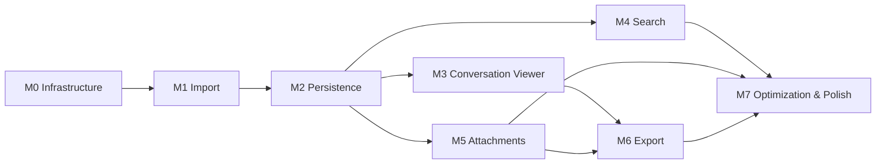

# Chat Archive Explorer — Implementation Roadmap v1.0

## Инженерный план реализации

**Статус:** проект Roadmap для утверждения  
**Версия:** 1.0  
**Дата:** 1 августа 2026 г.  
**Нормативная основа:** `Architecture Specification v1.0`  
**Назначение:** определить порядок реализации Chat Archive Explorer до начала написания продуктового кода

---

## 0. Нормативный статус

Этот документ определяет порядок реализации, зависимости, вертикальные срезы, тестовую стратегию, критерии завершения и основные технические риски проекта Chat Archive Explorer.

Roadmap не изменяет архитектуру. При конфликте между настоящим документом и `Architecture Specification v1.0` приоритет имеет архитектурная спецификация.

Термины:

- **Milestone** — завершённый этап, после которого существует запускаемое приложение;
- **Vertical slice** — минимальный сквозной сценарий от пользовательского входа до сохраняемого или отображаемого результата;
- **Definition of Done (DoD)** — обязательные критерии завершения этапа;
- **MUST** — обязательное требование;
- **SHOULD** — рекомендуемое требование;
- **MAY** — необязательное улучшение.

---

# 1. Цели Roadmap

Roadmap должен обеспечить:

1. работающий результат после каждого Milestone;
2. раннюю проверку самых рискованных архитектурных решений;
3. минимизацию объёма незавершённой работы;
4. постепенное наращивание функциональности без переписывания ядра;
5. возможность параллельной разработки независимых модулей;
6. наличие автоматических тестов на каждом этапе;
7. воспроизводимые сборки и миграции данных;
8. сохранение локального режима и отсутствия сетевой зависимости;
9. измеримые критерии готовности вместо субъективного «почти готово»;
10. возможность остановить разработку после любого этапа с полезным приложением.

---

# 2. Общая стратегия реализации

## 2.1. Vertical-slice-first

Компоненты не должны реализовываться как изолированные горизонтальные слои на месяцы вперёд. Каждый Milestone должен включать минимальный путь:

```text
User action
   ↓
Application service
   ↓
Domain model
   ↓
Infrastructure adapter
   ↓
Persisted or visible result
   ↓
Diagnostics and tests
```

Например, импорт считается работающим только тогда, когда пользователь может выбрать источник, запустить импорт, получить сохранённый разговор и увидеть итоговый отчёт.

## 2.2. Risk-first

Первыми проверяются риски, способные потребовать изменения архитектуры:

- потоковый импорт большого `conversations.json`;
- глубокие графы без рекурсивного переполнения;
- транзакционное сохранение;
- content-addressed blob storage;
- branch-aware read models;
- полнотекстовый индекс Unicode;
- безопасный экспорт HTML.

## 2.3. CLI before GUI

До появления полноценного GUI все ключевые use cases MUST быть доступны через CLI или минимальный локальный интерфейс. Это отделяет продуктовую логику от UI и ускоряет тестирование.

## 2.4. Derived state later

Поисковый индекс, thumbnails и экспортируемые представления внедряются только после появления стабильного нормализованного хранилища. Они должны быть пересоздаваемыми.

## 2.5. No hidden migrations

Каждое изменение схемы SQLite или формата blob metadata MUST сопровождаться:

- версией схемы;
- миграцией;
- тестом обновления;
- обратимой стратегией резервного копирования либо документированным запретом downgrade.

---

# 3. Карта Milestones



| Milestone | Рабочий результат |
|---|---|
| M0 | Запускаемое приложение с CLI, конфигурацией, логированием и self-check |
| M1 | Приложение открывает экспорт и строит проверяемую нормализованную модель в памяти |
| M2 | Импорт сохраняется в SQLite и blob storage; архив можно повторно открыть без исходного ZIP |
| M3 | Пользователь может просматривать разговоры, активную цепочку и альтернативные ветви |
| M4 | Пользователь может искать по сообщениям и переходить к результату в ветви |
| M5 | Пользователь может просматривать метаданные вложений и безопасно открывать физические файлы |
| M6 | Пользователь может экспортировать разговоры и весь архив в HTML/Markdown/JSON |
| M7 | Приложение устойчиво на больших архивах, имеет GUI-кандидат и готово к релизу 1.0 |

---

# 4. Зависимости и параллельная разработка

## 4.1. Критический путь

```text
M0 → M1 → M2 → M3 → M6 → M7
             ↘ M4 ↗
             ↘ M5 ↗
```

M2 является центральной точкой: до стабильного persistence layer нельзя надёжно строить просмотр, поиск, вложения и экспорт.

## 4.2. Независимые потоки после M2

После фиксации repository ports и схемы read models параллельно могут разрабатываться:

- ветвевой viewer;
- поисковый индексатор;
- blob/attachment presentation;
- HTML и Markdown renderers;
- diagnostics UI;
- performance harness;
- будущий GUI shell.

## 4.3. Контрактные границы

Параллельная работа разрешается только после фиксации следующих контрактов:

- domain entities и value objects;
- repository ports;
- query service read models;
- blob store port;
- exporter port;
- diagnostic record schema.

Изменения этих контрактов после начала параллельной разработки требуют архитектурного review.

---

# 5. M0 — Инфраструктура проекта

## 5.1. Цель

Создать воспроизводимую, тестируемую и запускаемую основу проекта без реализации бизнес-функций импорта.

## 5.2. Минимальный vertical slice

```text
Запуск приложения
   ↓
Разбор CLI-команды `doctor`
   ↓
Проверка конфигурации и writable data directory
   ↓
Вывод версии приложения, версии схемы и диагностического результата
```

## 5.3. Результат

Запускаемое CLI-приложение, которое:

- выводит справку и версию;
- создаёт локальную директорию приложения;
- читает конфигурацию;
- выполняет self-check;
- ведёт структурированный лог;
- возвращает корректные exit codes;
- запускает тесты в CI.

## 5.4. Основные работы

- структура пакетов согласно Architecture Specification;
- packaging и entry point;
- конфигурация development/test/release;
- logging и diagnostic primitives;
- базовые типы ошибок;
- временные директории и atomic file helpers;
- CI для macOS как основной платформы;
- статический анализ, форматирование, type checking;
- политика версий и changelog;
- fixture registry без реальных пользовательских данных.

## 5.5. Зависимости

Нет внешних Milestone-зависимостей.

## 5.6. Тесты

- smoke test запуска CLI;
- unit tests конфигурации;
- тесты exit codes;
- тесты atomic write helper;
- тесты structured diagnostic serialization;
- тест установки в чистом виртуальном окружении;
- CI matrix минимум на поддерживаемой версии Python для macOS.

## 5.7. Definition of Done

M0 завершён, если:

1. проект устанавливается одной документированной командой;
2. команда `doctor` завершается успешно в чистом окружении;
3. тестовый набор запускается локально и в CI;
4. отсутствуют сетевые обращения;
5. структура пакетов соответствует архитектуре;
6. публичные внутренние порты имеют первичные контракты;
7. ошибки отображаются пользователю без stack trace по умолчанию;
8. developer documentation позволяет новому участнику запустить проект менее чем за 15 минут.

## 5.8. Риски

| Риск | Минимизация |
|---|---|
| Преждевременный выбор GUI | GUI не включать в критический путь M0 |
| Избыточная инфраструктура | Реализовать только то, что используется в M1 |
| Нестабильные internal APIs | Фиксировать только минимальные порты |

---

# 6. M1 — Импорт архива в нормализованную модель

## 6.1. Цель

Реализовать acquisition, inventory, format detection, parsing, structural validation и normalization без долговременного хранилища.

## 6.2. Минимальный vertical slice

```text
Пользователь указывает ZIP или папку
   ↓
Источник инвентаризируется
   ↓
Манифест и conversations.json валидируются
   ↓
Один разговор нормализуется
   ↓
CLI показывает title, число узлов, сообщений и ветвей
```

## 6.3. Результат

Работающая команда предварительного импорта, например логически:

```text
inspect-export <source>
```

Она должна:

- принимать ZIP или директорию;
- не изменять источник;
- обнаруживать обязательные и необязательные файлы;
- определять поддерживаемый формат;
- читать JSON;
- строить нормализованные Conversation/Node/Message/ContentPart;
- проверять граф;
- показывать сводный отчёт и diagnostics;
- уметь ограничиться первыми N разговорами для быстрого smoke run.

## 6.4. Основные работы

- `ImportSourcePort` для folder и ZIP;
- inventory model;
- adapter OpenAI Export v1;
- parser conversation records;
- parser content variants;
- graph validator без рекурсии;
- branch derivation;
- unknown-field preservation;
- provenance records;
- validation severity model;
- import report in memory.

## 6.5. Зависимости

- M0;
- утверждённые domain contracts;
- нормативная Export Format Specification.

## 6.6. Тесты

### Unit

- разбор каждого подтверждённого `content_type`;
- неизвестный `content_type` сохраняется как opaque;
- построение parent/children;
- branch derivation;
- глубокая цепочка более 2 000 узлов без recursion error;
- cycle detection;
- missing parent;
- duplicate IDs;
- invalid `current_node`;
- timestamps и null values.

### Integration

- импорт минимальной папки;
- импорт ZIP;
- отсутствующий optional JSON;
- повреждённый JSON;
- конфликт manifest/inventory;
- импорт репрезентативного обезличенного fixture.

### Golden

- нормализованный JSON одного линейного разговора;
- разговор с альтернативными ветвями;
- multimodal message;
- reasoning/thoughts message;
- unknown fields.

## 6.7. Definition of Done

1. ZIP и folder дают одинаковую нормализованную модель;
2. исходные файлы не изменяются;
3. активная и альтернативные ветви восстанавливаются;
4. глубокие графы обрабатываются итеративно;
5. неизвестные поля не теряются;
6. ошибки одного разговора не останавливают анализ остальных, если это безопасно;
7. итоговые counts воспроизводимы;
8. команда выдаёт machine-readable report;
9. peak memory измерен на полном исследованном архиве и документирован;
10. приложение после M1 уже полезно как валидатор экспорта.

## 6.8. Риски

| Риск | Минимизация |
|---|---|
| Загрузка 78+ MB JSON целиком | Ранний memory benchmark; при необходимости streaming strategy |
| Рекурсивный обход графа | Только итеративные алгоритмы |
| Жёсткая привязка к OpenAI schema | Source DTO отдельно от domain model |
| Потеря неизвестных данных | Raw payload на уровне record/field |

---

# 7. M2 — Сохранение данных и повторное открытие архива

## 7.1. Цель

Добавить долговременное нормализованное хранилище, raw preservation и content-addressed blob storage.

## 7.2. Минимальный vertical slice

```text
Импорт одного разговора и одного файла
   ↓
Транзакционное сохранение в SQLite
   ↓
SHA-256 и atomic ingestion blob
   ↓
Закрытие приложения
   ↓
Повторный запуск и чтение разговора без исходного архива
```

## 7.3. Результат

Приложение может создать локальную библиотеку, импортировать архив и затем открыть её независимо от исходного ZIP или папки.

Минимально доступны команды/use cases:

- создать библиотеку;
- импортировать источник;
- показать список импортов;
- показать список разговоров;
- открыть краткую карточку разговора;
- проверить целостность metadata DB и blob store.

## 7.4. Основные работы

- SQLite schema v1;
- migrations framework;
- repositories для imports, conversations, nodes, messages, parts, branches;
- repositories для attachments, library records и blobs;
- raw source records;
- transaction boundaries;
- blob hash streaming;
- atomic move в content-addressed path;
- deduplication по SHA-256 и размеру;
- source-reference tables;
- import resume/rollback policy;
- integrity checker.

## 7.5. Зависимости

- M1;
- стабильная normalized domain model;
- repository ports и BlobStorePort.

## 7.6. Тесты

### Unit

- path derivation по SHA-256;
- blob deduplication;
- filename normalization без потери оригинала;
- transaction state machine;
- provenance persistence.

### Integration

- полный импорт fixture в SQLite;
- crash simulation до commit;
- повторный импорт тех же blob bytes;
- duplicate logical references к одному blob;
- отсутствующий физический `.dat`;
- mismatched manifest size;
- reopen database;
- schema migration from empty/v0 to v1.

### Integrity

- foreign keys;
- graph counts после round trip;
- SHA-256 file verification;
- orphan blob detection;
- orphan metadata detection.

## 7.7. Definition of Done

1. полный исследованный архив импортируется в локальную библиотеку;
2. после удаления или отключения исходного пути нормализованные данные доступны;
3. физические дубликаты не дублируются в blob store;
4. logical references сохраняются независимо от blob identity;
5. partial import не оставляет незаявленного committed состояния;
6. миграции выполняются автоматически и тестируются;
7. integrity check сообщает все нарушения без изменения данных;
8. raw unknown fields доступны для диагностики;
9. повторный импорт имеет определённое поведение и не создаёт бесконтрольные дубликаты;
10. приложение после M2 является минимальной локальной архивной базой.

## 7.8. Риски

| Риск | Минимизация |
|---|---|
| Слишком сложная схема БД | Начать с нормализованного минимального набора таблиц |
| Потеря данных при crash | temp files + fsync/atomic rename + DB transaction |
| Расхождение blob и DB | двухфазный staging и integrity audit |
| Невозможность миграций | schema version с первого commit |

---

# 8. M3 — Просмотр разговоров и альтернативных ветвей

## 8.1. Цель

Создать branch-aware read model и первый пользовательский интерфейс просмотра разговоров.

## 8.2. Минимальный vertical slice

```text
Список разговоров
   ↓
Выбор разговора
   ↓
Загрузка active branch
   ↓
Отображение user/assistant text
   ↓
Переход в одну альтернативную ветвь
```

## 8.3. Результат

Запускаемое приложение позволяет:

- просматривать список разговоров;
- сортировать по дате и заголовку;
- открывать активную цепочку;
- видеть точки ветвления;
- переключаться между альтернативами;
- отображать базовые типы контента;
- показывать unsupported content как диагностический placeholder;
- пагинировать или лениво загружать длинные разговоры.

Допускается CLI/TUI или минимальный локальный web/UI shell, если он не нарушает local-first и не становится архитектурной зависимостью ядра.

## 8.4. Основные работы

- ConversationSummary read model;
- ConversationGraphSummary;
- MessageView;
- branch navigation service;
- active branch selection;
- renderer registry;
- Markdown-safe text rendering;
- code block presentation;
- diagnostics badges;
- pagination/lazy loading;
- state restoration последнего открытого разговора MAY быть добавлено в конце этапа.

## 8.5. Зависимости

- M2;
- query services;
- stable branch model.

## 8.6. Тесты

- active branch reconstruction;
- отображение альтернативных листьев;
- point-of-divergence calculation;
- длинный разговор более 2 000 сообщений;
- empty text;
- multimodal placeholders;
- unknown content parts;
- escaping HTML/Markdown input;
- Unicode: русский, немецкий, английский, украинский;
- snapshot/golden tests render output;
- UI smoke test открытия разговора.

## 8.7. Definition of Done

1. пользователь открывает любой импортированный разговор;
2. active branch соответствует `current_node`;
3. все альтернативные ветви доступны, а не скрыты;
4. переключение ветвей не изменяет данные;
5. длинные разговоры не требуют загрузки всего DOM/read model;
6. неизвестный контент не приводит к падению;
7. текст и код отображаются безопасно;
8. branch-aware навигация покрыта golden fixtures;
9. UI не выполняет прямые SQL-запросы;
10. приложение после M3 уже является полезным локальным просмотрщиком архива.

## 8.8. Риски

| Риск | Минимизация |
|---|---|
| UI предполагает линейный чат | Branch model обязателен в read service |
| Очень длинные разговоры | Pagination, virtualization или chunked rendering |
| XSS через архивный текст | Escape by default; sanitization tests |
| Renderer становится монолитом | Registry по content part type |

---

# 9. M4 — Поиск и индексация

## 9.1. Цель

Добавить локальный полнотекстовый поиск по нормализованным данным с переходом к конкретному сообщению и ветви.

## 9.2. Минимальный vertical slice

```text
Импортированный разговор
   ↓
Индексация message text
   ↓
Поисковый запрос
   ↓
Результат со snippet
   ↓
Открытие сообщения в корректной ветви
```

## 9.3. Результат

Пользователь может искать по:

- тексту сообщений;
- заголовкам разговоров;
- исходным именам файлов;
- ролям;
- датам;
- моделям, если сохранены;
- коду как обычному тексту.

Результат должен указывать:

- conversation;
- message;
- роль;
- snippet;
- branch context;
- наличие результата на active или alternative branch.

## 9.4. Основные работы

- SQLite FTS adapter;
- index document model;
- incremental indexing queue;
- rebuild command;
- branch-aware result resolver;
- Unicode tokenizer evaluation;
- filters;
- ranking policy;
- stale-index detection.

## 9.5. Зависимости

- M2;
- M3 для удобного перехода к результату, но индексатор может разрабатываться параллельно с M3.

## 9.6. Тесты

- точное и частичное совпадение;
- Unicode и смешанные языки;
- punctuation и code tokens;
- alternative branch result;
- удалённое/обновлённое сообщение и reindex;
- deterministic rebuild;
- индекс можно удалить и восстановить;
- performance test на полном архиве;
- query latency percentiles.

## 9.7. Definition of Done

1. индекс полностью пересоздаваем из metadata DB;
2. удаление индекса не приводит к потере исходных данных;
3. поиск находит сообщения в альтернативных ветвях;
4. переход открывает правильный conversation/node;
5. фильтры не требуют полного scan БД;
6. индексирование не блокирует чтение всей библиотеки;
7. ошибки индексирования диагностируются отдельно от импорта;
8. полная переиндексация исследованного архива укладывается в зафиксированный performance budget;
9. Unicode fixtures проходят;
10. приложение после M4 является поисковой библиотекой разговоров.

## 9.8. Риски

| Риск | Минимизация |
|---|---|
| Неудовлетворительная токенизация | Изолированный SearchPort и измеримые fixtures |
| Индекс расходится с DB | generation/version marker и rebuild |
| Слишком большой индекс | Индексировать только полезные поля, измерять размер |

---

# 10. M5 — Вложения и Blob Storage UX

## 10.1. Цель

Сделать логические вложения и физические blobs доступными пользователю без нарушения безопасности и без смешения сущностей.

## 10.2. Минимальный vertical slice

```text
Сообщение с attachment
   ↓
Attachment → LibraryRecord → Blob resolution
   ↓
Показ имени, MIME, magic, размера и provenance
   ↓
Сохранение копии пользователем в выбранное место
```

## 10.3. Результат

Приложение позволяет:

- видеть вложения сообщения;
- различать отсутствующий blob и отсутствующую metadata link;
- показывать original filename, observed MIME, detected format, size и hash;
- безопасно открыть или сохранить копию файла;
- видеть shared blob references;
- отображать изображения через отдельный безопасный preview adapter MAY, но preview не является условием завершения M5;
- выполнять blob integrity check.

## 10.4. Основные работы

- attachment resolver;
- LibraryRecord/Blob read models;
- magic number registry;
- safe filename policy;
- save-as service;
- external-open policy;
- MIME conflict display;
- missing/failed/created-state presentation;
- duplicate blob reference UI;
- optional thumbnail pipeline как derived cache.

## 10.5. Зависимости

- M2;
- viewer integration желательно с M3, но attachment services могут разрабатываться отдельно.

## 10.6. Тесты

- один blob, несколько attachment references;
- один blob, несколько original names;
- missing `.dat`;
- size mismatch;
- MIME mismatch;
- signature mismatch;
- unsafe filename/path traversal;
- duplicate SHA-256;
- save-as exact bytes;
- no automatic execution;
- permission errors;
- large blob streaming.

## 10.7. Definition of Done

1. attachment, library record и blob не смешиваются в одной сущности;
2. пользователь видит provenance и конфликты;
3. file type определяется по magic с явным уровнем уверенности;
4. сохранённая копия byte-identical исходному blob;
5. blob не исполняется автоматически;
6. path traversal невозможен;
7. missing blobs отображаются как диагностическое состояние;
8. SHA-256 duplicates корректно представлены как один физический blob с несколькими ссылками;
9. операция работает потоково для больших файлов;
10. приложение после M5 является полноценным локальным архивом с вложениями.

## 10.8. Риски

| Риск | Минимизация |
|---|---|
| Небезопасное открытие файлов | Save-as по умолчанию, explicit external open |
| Ошибочный MIME | Magic first, metadata retained as observed value |
| Рост thumbnails | Rebuildable cache с quota |
| Путаница logical/physical | Отдельные read models и UI labels |

---

# 11. M6 — Экспорт HTML, Markdown и Normalized JSON

## 11.1. Цель

Реализовать воспроизводимые экспортёры поверх нормализованной модели, не используя `chat.html` как источник истины.

## 11.2. Минимальный vertical slice

```text
Выбор разговора
   ↓
Выбор branch policy
   ↓
Renderer registry
   ↓
Создание Markdown и HTML
   ↓
Открытие результата локально
```

## 11.3. Результат

Пользователь может экспортировать:

- один разговор;
- выбранную ветвь;
- active branch;
- все ветви;
- весь архив с index page;
- normalized JSON;
- attachments по заданной политике.

Минимально поддерживаются:

- Markdown;
- self-contained или directory-based HTML;
- normalized JSON;
- общий `index.html` для набора разговоров.

## 11.4. Основные работы

- ExporterPort;
- export plan;
- branch policy;
- filename collision policy;
- Markdown renderer;
- HTML templates;
- safe escaping;
- asset copy/link policy;
- index generation;
- deterministic ordering;
- manifest экспорта;
- partial failure reporting.

## 11.5. Зависимости

- M3;
- M5 для полного attachment export;
- M2 как источник истины.

## 11.6. Тесты

- active branch export;
- all branches export;
- branch labels и divergence points;
- code fences;
- Unicode filenames;
- duplicate titles;
- filename sanitization;
- HTML escaping/XSS;
- missing attachment;
- byte-identical copied blob;
- deterministic repeated export;
- golden HTML/Markdown;
- link integrity checker;
- large archive export performance.

## 11.7. Definition of Done

1. экспорт строится только из domain/query services;
2. HTML не исполняет содержимое архива;
3. Markdown сохраняет chronology и code blocks;
4. branch policy явна и записана в output manifest;
5. all-branches export не теряет альтернативы;
6. index.html содержит ссылки на все успешно экспортированные разговоры;
7. ошибки отдельных вложений не уничтожают весь экспорт;
8. repeated export с одинаковыми inputs детерминирован;
9. normalized JSON документирован и versioned;
10. приложение после M6 удовлетворяет первоначальному требованию локального экспорта Markdown/HTML.

## 11.8. Риски

| Риск | Минимизация |
|---|---|
| Неявная потеря ветвей | Обязательный branch policy |
| XSS | Escape by default, CSP для HTML |
| Коллизии имён | Stable ID suffix и manifest |
| Разные renderers расходятся | Общий renderer registry/content model |

---

# 12. M7 — Оптимизация, полировка и релизная готовность

## 12.1. Цель

Довести систему до устойчивого локального приложения, готового к публичному open-source релизу 1.0.

## 12.2. Минимальный vertical slice

```text
Чистая установка
   ↓
Импорт полного архива
   ↓
Открытие, поиск, вложения, экспорт
   ↓
Перезапуск
   ↓
Integrity check и воспроизводимый результат
```

## 12.3. Результат

Release candidate с:

- стабильным CLI;
- выбранным GUI shell или документированным GUI postponement;
- import progress и cancellation;
- performance budgets;
- recovery flows;
- migration guarantees;
- пользовательской документацией;
- privacy/security review;
- packaging для macOS;
- подготовленной совместимостью Windows/Linux на уровне core.

## 12.4. Основные работы

- profiling и hotspots;
- bounded memory;
- import cancellation/resume;
- progress model;
- database indexes tuning;
- lazy loading;
- cache policies;
- diagnostics UX;
- packaging/signing strategy;
- backup/restore;
- upgrade tests;
- accessibility baseline;
- localization readiness;
- release documentation;
- OSS governance: license, contributing, security policy.

## 12.5. Зависимости

- M3–M6 завершены;
- архитектурные контракты стабилизированы.

## 12.6. Тесты

### End-to-end

- clean install → import → search → export;
- restart and reopen;
- cancellation during import;
- disk-full simulation;
- corrupt DB backup recovery;
- missing blob after import;
- upgrade previous schema;
- read-only source;
- Unicode paths.

### Performance

- полный исследованный архив;
- synthetic archive значительно больше текущего;
- deep graph;
- many small blobs;
- few large blobs;
- search latency;
- export throughput;
- peak memory.

### Security

- ZIP slip;
- decompression bombs через лимиты inventory;
- malicious filenames;
- HTML injection;
- symlink handling;
- external file opening;
- sensitive logging review.

## 12.7. Definition of Done

1. все ключевые сценарии проходят end-to-end;
2. performance budgets задокументированы и соблюдаются;
3. нет известных ошибок severity critical/high;
4. recovery paths протестированы;
5. schema migrations протестированы на предыдущей released schema;
6. приложение не требует интернет;
7. macOS package устанавливается и запускается на чистой системе;
8. core не содержит macOS-only зависимостей без adapter boundary;
9. документация покрывает import, view, search, attachments, export и diagnostics;
10. релиз может быть воспроизведён из исходного кода.

## 12.8. Риски

| Риск | Минимизация |
|---|---|
| Оптимизация слишком поздно | Benchmarks с M1, M2, M4 и M6 |
| GUI задерживает релиз | CLI остаётся полноценным интерфейсом |
| Платформенные зависимости | Ports/adapters и CI preparation |
| Неконтролируемый scope | Всё вне DoD переносится после 1.0 |

---

# 13. Сквозные тестовые требования

## 13.1. Test pyramid

```text
Few end-to-end tests
        ↑
Integration tests
        ↑
Many unit/property tests
```

## 13.2. Обязательные fixture-категории

Набор fixtures MUST включать:

- минимальный линейный разговор;
- разговор с двумя ветвями;
- несколько точек ветвления;
- глубина более 2 000;
- multimodal content;
- unknown content part;
- attachment без blob;
- blob с MIME conflict;
- duplicate blobs;
- Unicode text и filenames;
- повреждённый manifest;
- повреждённый graph;
- ZIP source и folder source.

Реальные пользовательские данные MUST NOT попадать в публичный репозиторий.

## 13.3. Golden outputs

Golden tests применяются для:

- normalized model;
- diagnostics report;
- HTML;
- Markdown;
- normalized JSON;
- search result snippets;
- graph summaries.

Golden files должны быть компактными и обозримыми в code review.

## 13.4. Property tests

Рекомендуемые свойства:

- branch path всегда начинается в root и заканчивается leaf;
- у tree node не более одного parent;
- save/load сохраняет IDs и ordering;
- blob path является функцией hash;
- одинаковые bytes дают один blob identity;
- export никогда не создаёт путь вне target directory;
- индекс rebuild не меняет canonical data.

---

# 14. Технические риски проекта

| Риск | Вероятность | Влияние | Этап ранней проверки | Мера |
|---|---:|---:|---|---|
| Большой JSON не помещается в память на слабых системах | Средняя | Высокое | M1 | benchmark, streaming adapter при необходимости |
| Глубокие графы вызывают recursion failure | Высокая без защиты | Высокое | M1 | итеративные обходы |
| SQLite schema слишком жёсткая для новых типов | Средняя | Высокое | M2 | typed core + raw JSON + extensible tables |
| Blob/DB расходятся после crash | Средняя | Высокое | M2 | staging, atomic rename, integrity checker |
| Поиск плохо работает на смешанных языках | Средняя | Среднее | M4 | tokenizer evaluation и SearchPort |
| HTML exporter создаёт XSS | Средняя | Высокое | M3/M6 | escaping, CSP, security fixtures |
| Ветви теряются в UI/export | Средняя | Высокое | M3/M6 | branch-aware contracts и golden tests |
| GUI-фреймворк тормозит core | Средняя | Среднее | M7 | CLI-first, presentation adapter |
| Scope creep до 1.0 | Высокая | Высокое | Все | строгий DoD и deferred backlog |
| Новая версия OpenAI export | Высокая в будущем | Среднее | M1+ | versioned source adapters, unknown preservation |
| Данные пользователя попадают в логи | Средняя | Высокое | M0/M7 | redaction policy и privacy tests |

---

# 15. Этапы, после которых приложение можно запускать

| Milestone | Запускаемость | Пользовательская ценность |
|---|---|---|
| M0 | Да | Диагностика установки и среды |
| M1 | Да | Проверка и инспекция экспорта |
| M2 | Да | Локальная нормализованная архивная база |
| M3 | Да | Просмотр разговоров и ветвей |
| M4 | Да | Полнотекстовый поиск |
| M5 | Да | Работа с вложениями |
| M6 | Да | Экспорт Markdown/HTML/JSON |
| M7 | Да | Релизный продукт |

Ни один Milestone не считается завершённым, если его рабочий сценарий существует только в unit tests или отдельном internal script.

---

# 16. Рекомендуемое разбиение на версии

Номера версий являются предложением и могут быть изменены без изменения последовательности Milestones.

| Версия | Milestone | Назначение |
|---|---|---|
| 0.1.0 | M0 | Project shell / doctor |
| 0.2.0 | M1 | Export inspector and validator |
| 0.3.0 | M2 | Persistent local archive |
| 0.4.0 | M3 | Conversation and branch viewer |
| 0.5.0 | M4 | Search |
| 0.6.0 | M5 | Attachments and blobs |
| 0.7.0 | M6 | HTML/Markdown/JSON exporters |
| 0.8.x | M7 early | Performance and recovery previews |
| 1.0.0 | M7 complete | Stable public release |

---

# 17. Модули, допускающие независимую разработку

После M0:

- diagnostics framework;
- fixture builder;
- source inventory;
- graph algorithms.

После фиксации M1 domain contracts:

- SQLite schema prototype;
- blob store;
- renderers;
- normalized JSON serializer.

После M2:

- search adapter;
- conversation viewer;
- attachment UI;
- HTML exporter;
- Markdown exporter;
- performance harness;
- GUI shell.

Каждый независимый модуль MUST иметь contract tests против соответствующего порта.

---

# 18. Governance реализации

## 18.1. Изменение архитектуры

Любое изменение, затрагивающее:

- domain entities;
- source-of-truth rules;
- persistence boundaries;
- blob identity;
- branch semantics;
- raw preservation;

требует Architecture Decision Record и обновления Architecture Specification.

## 18.2. Изменение Roadmap

Перестановка Milestones допускается только если:

- сохраняется запускаемый vertical slice;
- не нарушаются зависимости;
- риск переноса документирован;
- DoD остаётся измеримым.

## 18.3. Release gate

Каждый Milestone проходит gate review:

1. рабочая демонстрация;
2. тестовый отчёт;
3. список diagnostics и известных ограничений;
4. performance snapshot;
5. подтверждение DoD;
6. обновлённая документация.

---

# 19. Что сознательно не входит в Roadmap 1.0

Следующие функции не должны блокировать релиз 1.0:

- PDF exporter;
- интеллектуальный поиск;
- embeddings и vector DB;
- облачная синхронизация;
- плагины;
- сравнение двух экспортов;
- статистические dashboards;
- теги и избранное;
- автоматическое инкрементальное объединение экспортов;
- Windows/Linux installers;
- OCR;
- thumbnail generation для всех форматов.

Архитектура должна позволять их добавить позднее, но реализация до завершения M7 считается scope expansion.

---

# 20. Итоговый Definition of Done для Roadmap 1.0

Roadmap реализован полностью, если Chat Archive Explorer:

1. устанавливается и запускается локально;
2. принимает ZIP и папку экспорта;
3. валидирует и нормализует разговоры;
4. сохраняет данные и raw provenance;
5. хранит blobs content-addressed;
6. сохраняет альтернативные ветви;
7. повторно открывает архив без исходного источника;
8. показывает разговоры и ветви;
9. выполняет локальный поиск;
10. показывает и экспортирует вложения безопасно;
11. экспортирует Markdown, HTML и normalized JSON;
12. имеет воспроизводимые diagnostics;
13. восстанавливает derived indexes;
14. выдерживает полный исследованный архив в performance budget;
15. не требует подключения к интернету;
16. имеет автоматические unit, integration, golden, property, security и end-to-end tests;
17. имеет документированные миграции и recovery policy;
18. готов к публичному open-source релизу 1.0.

---

# 21. Готовность к реализации

`Architecture Specification v1.0` предоставляет достаточную основу для начала M0.

До начала реализации не требуется дополнительное исследование текущего экспорта.

Перед первым commit продуктового кода требуется утвердить только организационные параметры:

- минимальную поддерживаемую версию Python;
- менеджер сборки/пакетирования;
- лицензию open-source проекта;
- целевую версию macOS для первой сборки;
- политику хранения raw source по умолчанию;
- формат ведения Architecture Decision Records.

Эти решения не меняют последовательность Milestones и могут быть приняты в рамках M0.

После утверждения настоящего документа следующим шагом является начало M0, а не дополнительное проектирование функциональности.
